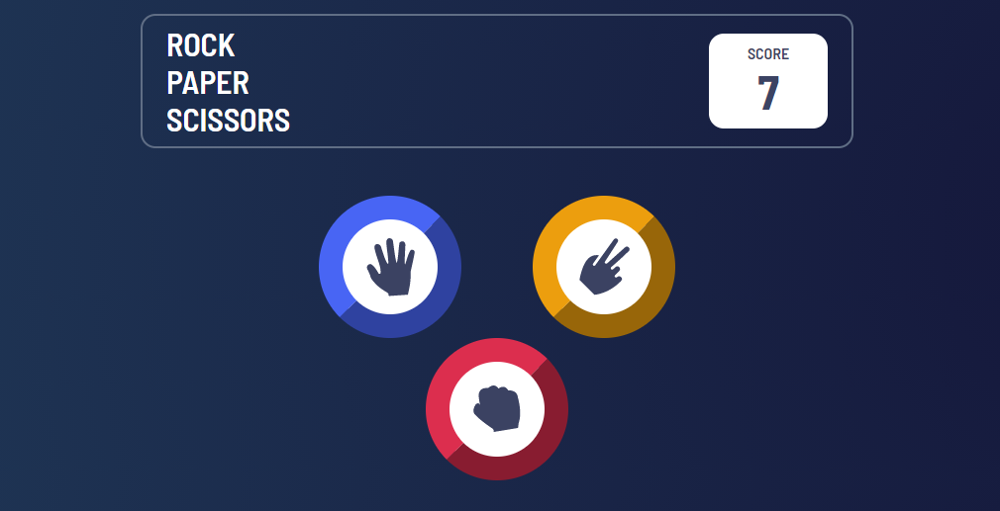
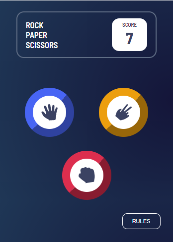

# Pedra, Papel Tesoura



## Bem-vindo(a)! 👋

Este projeto é uma simpes representação do jogo conhecido como **Pedra, Papel, Tesoura.**

As tecnologias utilizadas nesse jogo foram:

[HTML5](https://developer.mozilla.org/en-US/docs/Web/Guide/HTML/HTML5)

[CSS3](https://developer.mozilla.org/pt-BR/docs/Web/CSS)

[Javascript Puro](https://developer.mozilla.org/pt-BR/docs/Web/JavaScript)

## Desafios do Projeto

Os principais desafios para a conclusão desse projeto foram envolvendo a lógica de funcionamento do sistema, desde o contador de vitórias do usuário até o sistema escolha aleatória da máquina. Para resolver esse último, utilizei a biblioeca `Math` do próprio Javascript. O código para essa resolução está logo a baixo:

```javascript
//Escolha do computador, gerada de forma aleatória
function randomOption() {
  //Função para gerar um número random entre as opções disponíveis
  function numberRandom() {
    let numberGeneration = Math.floor(
      Math.random() * (options.length - 1 + 1) + 0
    );

    return numberGeneration;
  }
```

## Responsividade

O layout do jogo esá totalmente responsivo para dispositivos móveis



## Jogue você mesmo!

O jogo foi hospedado no sistema de hospedagem da [Vercel](https://vercel.com/)

Clique [aqui](https://rock-paper-scissors-master-theta.vercel.app/) para jogar e boa sorte!
